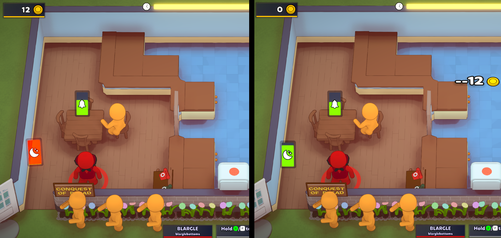
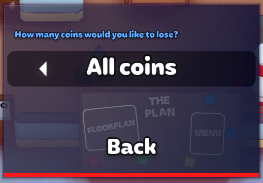

# overcooked patience

Makes a customer losing patience not a game-ending situation, assuming you have enough coins.

The default for each game session is to take all of the coins you have, but that can be changed to 10 coins or 5 coins per impatient customer in the preferences.

## Requirements

* BepinEx >= 5.4.21

## Installation

* Download OvercookedPatience.dll and add to your `PlateUp/BenInEx/plugins` folder.

## Acknowledgements
* Pimpin'Yuu and [Straightedge109 [twitch]](https://twitch.tv/straightedge109) for suffering through testing with me
