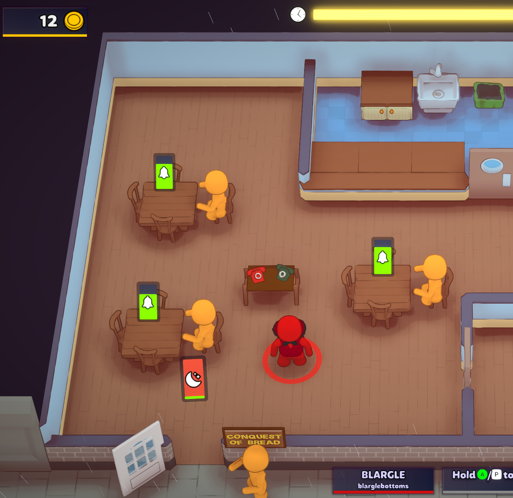
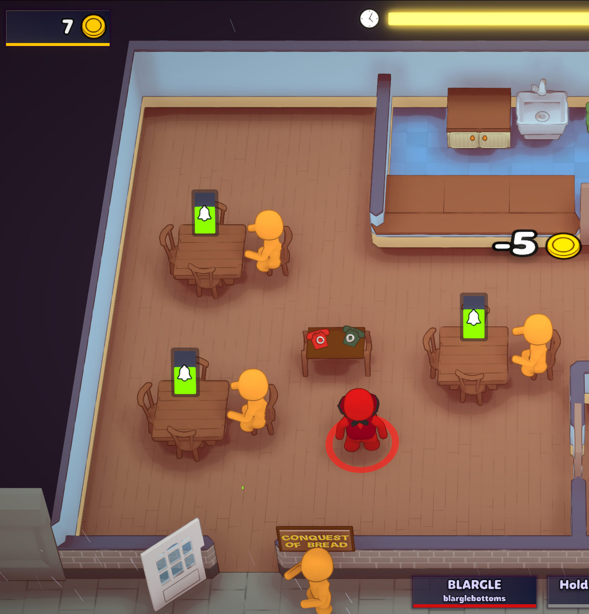
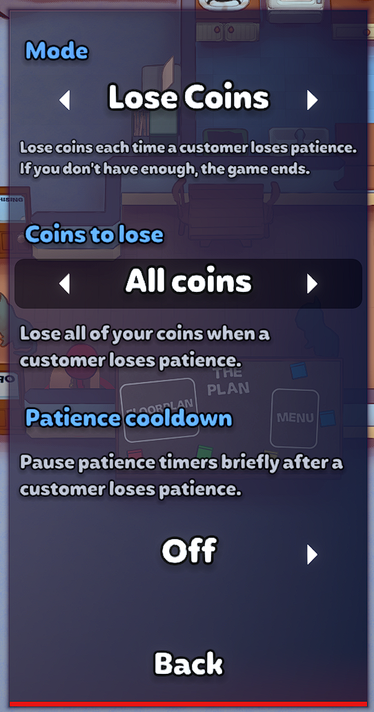

# overcooked patience

Makes a customer losing patience not a game-ending situation, assuming you have enough coins.

There are two modes, available in the Mod Settings menu:
* Lose Coins: When a customer loses patience, lose 0, 5, 10, or ALL of your coins. Additionally, selecting "progressive" will cause you to lose 5, 10, 15, etc per group (resets each day). If you have no coins to lose (when "0" isn't selected), the game ends.
* 3 strikes: If 3 customers lose patience in one day, the game ends.

Note: This mod only works through the workshop.

## Requirements

* KitchenLib
* Harmony

## Installation

* Install through the [Workshop](https://steamcommunity.com/sharedfiles/filedetails/?id=2898989967)

## Acknowledgements
* Pimpin'Yuu and [Straightedge109 [twitch]](https://twitch.tv/straightedge109) for suffering through testing with me
* ValenberghsSven / Testymagic for helping figure out why money would occasionally disappear unexpectedly at the end of days
